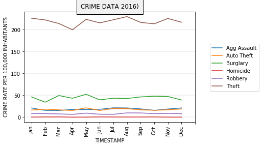
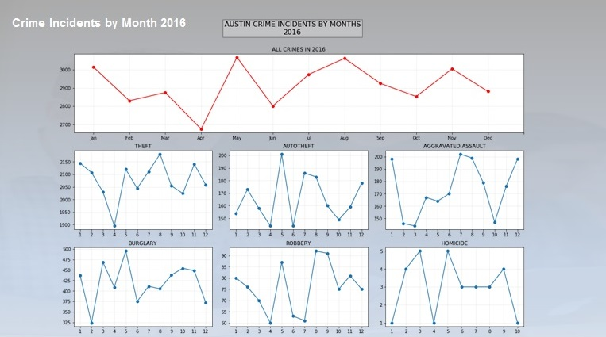

## AUSTIN CRIME DATA ANALYSIS

 

### PURPOSE OF THE STUDY
* Analyze data to identify trends in crime across the City of Austin over the years (from 2014 to 2016).
* To determine a comparison of the crime rate with respect to the area of occurrence (districts) and time of the year (months).
* To identify a particular crime type likeliest to occur at a certain season of the year.
* And to determine the spread of particular crimes across the city with respect to the districts. 

### DATA SOURCES

* Austin_Crime dataset was retrieved from the Kaggle website – csv format with 19121 kb of data and 159464 data entries. 
    This had a lot of rows with missing data.
* Austin Crime Dataset 2015 from Data.Gov website – csv format with 7702 kb of data and 38573 data entries.
* 2016_Annula_Crime_Data dataset from Data.Gov website – csv format with 7432 kb of data and 37461 data entries.
* United States Census Bureau – to retrieve population estimate for the City of Austin for the years 2014, 2015 and 2016.

### DATA AQUISITION
For this project study, we collected and compiled the recent crime reporting numbers available for the City of Austin on five major crimes which are: Aggravated assault, auto theft, homicide, robbery and theft. We also made use of the US census Bureau to get the population estimate for the respective years. We tried to obtain 2017 reports, but we were unable to get the data. 

### ANALYSIS TOOLS
Python’s data evaluation and visualization packages, which includes:
      Pandas (Data Analysis library) and 
      Matplotlib (Visualization library) were utilized extensively through out the project.

### DATA WRANGLING
* The data wrangling process was initiated by reading into the retrieved CSV files and converting them into data frames.
* The basic cleanup process included dropping off unnecessary columns from the dataset, dropping rows with null values, 
  reordering columns, changing the time format and aggregating similar crime types.

### DATA VISUALIZATIONS

 

* Pie charts were plotted for all three years (2014-2016) individually to display the break up of each crime percentage 
  in Austin.

 

* Line graph plotting of crime rates (per 100,000 inhabitants) for each month of the year(from 2014-2016) was performed. 

* To make it easier to understand how the five crime types have changed over time in relation to each other, individual 
  line plots for each offense type were created characterized by months of the year. These line graphs show the trending 
  of specific crimes in the city of Austin from 2014 to 2016. 
* The crime counts and rates represented on the graphs cover the period of 2014 to 2016.
* The crime rates are calculated per 100,000 residents of the City of Austin.

### INFERENCES

 It can be deduced from the graphs that certain months of the year (mostly,from april to August) were more prone to crimes. 
 The data for nearly all types of crimes show a decrease between September to March but the seasonal spikes in summer (April to August) remain. 
 It is evident from the graphical results that the number of homicidal crime instances are negligibly small in comparison to theft, which takes up a fair share of all other crimes.
  
